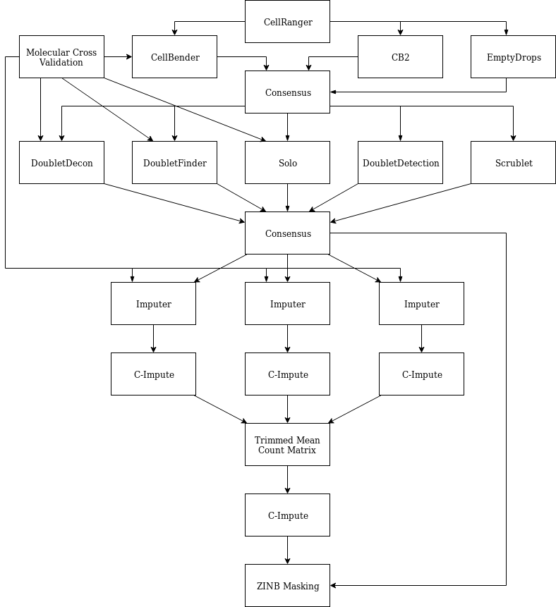

# Installation
```
devtools::install_github("cnk113/ESCAPE", subdir="pkg")
```
# Removal of ambient RNA, empty droplets, and barcode swapping
[CellBender](https://github.com/broadinstitute/CellBender)

[CB2](https://github.com/zijianni/scCB2)

[EmptyDrops](https://bioconductor.org/packages/devel/bioc/html/DropletUtils.html)

# Doublet removal
[Scrublet](https://github.com/swolock/scrublet)

[DoubletFinder](https://github.com/chris-mcginnis-ucsf/DoubletFinder)

[DoubletDetection](https://github.com/JonathanShor/DoubletDetection)

[DoubletDecon](https://github.com/EDePasquale/DoubletDecon)

[Solo](https://github.com/calico/Solo)

# Imputation
[DrImpute](https://github.com/ikwak2/DrImpute)

[SAVER](https://github.com/mohuangx/SAVER)

[SAVER-X](https://github.com/jingshuw/SAVERX)

[scImpute](https://github.com/Vivianstats/scImpute)

[scRMD](https://github.com/ChongC1990/scRMD)

[DeepImpute](https://github.com/lanagarmire/deepimpute)

[scHinter](https://github.com/BMILAB/scHinter)

[CIDR](https://github.com/VCCRI/CIDR)

[netSmooth](https://github.com/BIMSBbioinfo/netSmooth)

[scLINE](https://github.com/BMILAB/scLINE)

[BUSseq](https://github.com/songfd2018/BUSseq-1.0)

[scVI](https://github.com/YosefLab/scVI)

[scNPF](https://github.com/BMILAB/scnpf)

[I-Impute](https://github.com/xikanfeng2/I-Impute)

[netNMF-sc](https://github.com/raphael-group/netNMF-sc)

[ENHANCE](https://github.com/yanailab/enhance-R)

[BISCUIT](https://github.com/sandhya212/BISCUIT_SingleCell_IMM_ICML_2016)

[RESCUE](https://github.com/seasamgo/rescue)

[bayNorm](https://github.com/WT215/bayNorm)

[scRecover](https://github.com/cnk113/scRecover)

[SCRIBE](https://github.com/YiliangTracyZhang/SCRIBE)

[scGAIN](https://www.biorxiv.org/content/biorxiv/early/2019/11/12/837302.full.pdf)

[scDoc](https://github.com/anlingUA/scDoc)

[AutoImpute](https://github.com/divyanshu-talwar/AutoImpute)

[SCRABBLE](https://github.com/software-github/SCRABBLE)

[scTSSR](https://github.com/Zhangxf-ccnu/scTSSR)

[scScope](https://github.com/AltschulerWu-Lab/scScope)

[ADImpute](http://cellnet-sb.cecad.uni-koeln.de/resources/adaptive-dropout-imputer-adimpute/)

[VIPER](https://github.com/ChenMengjie/VIPER)

[DCA](https://github.com/theislab/dca) 

[LATE](https://github.com/audreyqyfu/LATE)

[MAGIC](https://github.com/KrishnaswamyLab/MAGIC)

[SigEMD](https://github.com/NabaviLab/SigEMD)

[mcImpute](https://github.com/aanchalMongia/McImpute_scRNAseq)

[DECODE](https://github.com/shmohammadi86/DECODE)

[PBLR](http://page.amss.ac.cn/shihua.zhang/software.html)

[Scedar](https://github.com/logstar/scedar)

[SCINET](https://github.com/shmohammadi86/SCINET)

[WEDGE](https://github.com/QuKunLab/WEDGE)
